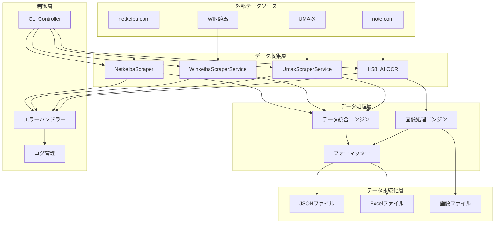
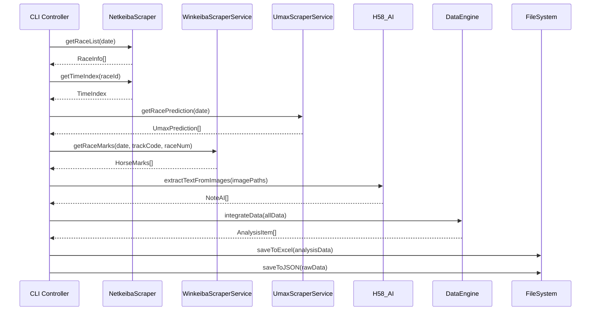

# システムアーキテクチャ

## システム概要

競馬予想データ統合システムは、複数の競馬情報サイトからデータを自動収集し、統合分析を行うマイクロサービス型のスクレイピングシステムです。

## アーキテクチャ図



## レイヤー構成

### 1. データ収集層（Data Collection Layer）

#### NetkeibaScraper
- **責務**: netkeibaからタイム指数、データ分析、CP予想を取得
- **技術**: Playwright、DOM操作
- **特徴**: 
  - レース一覧の一括取得
  - タイム指数の複数種類対応（最高値、平均値、距離別）
  - 偏差値・急上昇・自己ベストの複合データ取得

#### WinkeibaScraperService
- **責務**: WIN競馬から新聞印情報と分析データを取得
- **技術**: Playwright、認証機能
- **特徴**:
  - ログイン認証の自動化
  - 新聞印（◎○▲△）の数値化
  - タイム・上がり3F・馬場特性の総合分析

#### UmaxScraperService
- **責務**: UMA-Xから各種指数データを取得
- **技術**: Playwright、データ解析
- **特徴**:
  - 注目馬リストの取得
  - SP・AG・SA・KI値の多次元指数取得

#### H58_AI OCR
- **責務**: note画像からAI予想データを抽出
- **技術**: OpenAI Vision API、Sharp画像処理
- **特徴**:
  - 画像の自動切り取り・結合
  - 予想マーク（◎○☆▲△）の認識
  - 信頼度付きOCR結果

### 2. データ処理層（Data Processing Layer）

#### データ統合エンジン
```typescript
interface DataIntegrationEngine {
    // 複数ソースのデータを統合
    integrateRaceData(
        netkeibaData: NetkeibaData,
        winkeibaData: WinkeibaData,
        umaxData: UmaxData,
        aiData: AIData
    ): AnalysisItem;
    
    // 競馬場コード順でソート
    sortByTrackCode(items: AnalysisItem[]): AnalysisItem[];
    
    // データの整合性チェック
    validateData(item: AnalysisItem): boolean;
}
```

#### 画像処理エンジン
```typescript
interface ImageProcessingEngine {
    // 画像の取得と保存
    fetchAndSaveImages(url: string, date: string, trackCode: string): Promise<string[]>;
    
    // 画像の切り取りと結合
    processImage(imagePath: string): Promise<string>;
    
    // OCRによるテキスト抽出
    extractText(imagePath: string): Promise<OCRResult>;
}
```

### 3. データ永続化層（Data Persistence Layer）

#### ファイルシステム構成
```
data/
├── analysis/           # 各レースの詳細分析データ（JSON）
├── races/             # レース一覧データ（JSON）
└── backups/           # バックアップファイル

umax-data/             # UMA-X専用データ（Excel）

ai-note-images/        # AI予想画像
├── YYYYMMDD/
│   ├── original/      # 元画像
│   ├── processed/     # 処理済み画像
│   └── ocr-results/   # OCR結果

note_images/           # note指数画像

logs/                  # ログファイル
├── YYYYMMDD_prediction.log
├── error.log
└── debug.log
```

## データフロー

### 1. メインデータフロー


### 2. 画像処理フロー
```mermaid
sequenceDiagram
    participant H58 as H58_AI
    participant Note as note.com
    participant Sharp as Sharp
    participant OpenAI as OpenAI API
    participant FS as FileSystem
    
    H58->>Note: fetchImagesFromNote(url)
    Note-->>H58: 画像データ
    
    H58->>FS: 元画像保存
    
    H58->>Sharp: processImage(imagePath)
    Sharp-->>H58: 切り取り・結合済み画像
    
    H58->>FS: 処理済み画像保存
    
    H58->>OpenAI: Vision API (OCR)
    OpenAI-->>H58: 構造化データ
    
    H58->>FS: OCR結果保存
```

## 技術的決定事項

### 1. スクレイピング技術の選択

#### Playwright採用理由
- **JavaScript実行**: SPAサイトの動的コンテンツ対応
- **ブラウザ自動化**: 認証フローの自動化
- **安定性**: ページ読み込み待機の確実な制御
- **デバッグ機能**: スクリーンショット、ネットワーク監視

#### 代替案との比較
| 技術 | メリット | デメリット | 採用理由 |
|------|----------|------------|----------|
| Playwright | JS実行、認証対応 | リソース消費大 | ✅ 複雑なサイト対応 |
| Puppeteer | 軽量、高速 | Chrome限定 | ❌ ブラウザ依存 |
| Cheerio | 軽量、高速 | 静的コンテンツのみ | ❌ SPA非対応 |

### 2. 画像処理技術

#### Sharp採用理由
- **高性能**: libvipsベースの高速処理
- **メモリ効率**: ストリーミング処理対応
- **機能豊富**: 切り取り、結合、フォーマット変換

#### OpenAI Vision API採用理由
- **高精度**: 競馬予想マークの認識精度
- **構造化出力**: JSON Schemaによる確実なデータ抽出
- **多言語対応**: 日本語テキストの認識

### 3. データ統合アーキテクチャ

#### 統合戦略
```typescript
// 段階的データ統合
class DataIntegrationStrategy {
    // 1. 基本データの統合（日付、競馬場、レース番号）
    private integrateBaseData(sources: DataSource[]): BaseRaceData;
    
    // 2. 予想データの統合（各サイトの予想結果）
    private integratePredictionData(base: BaseRaceData, predictions: PredictionData[]): RaceWithPredictions;
    
    // 3. 分析データの統合（指数、偏差値等）
    private integrateAnalysisData(race: RaceWithPredictions, analysis: AnalysisData[]): AnalysisItem;
    
    // 4. 結果データの統合（レース結果）
    private integrateResultData(analysis: AnalysisItem, results: ResultData[]): CompleteRaceData;
}
```

### 4. エラーハンドリング戦略

#### 階層化エラー処理
```typescript
// レベル1: 個別処理エラー
try {
    const data = await scraper.getData();
} catch (error) {
    logger.warn(`個別処理エラー: ${error.message}`);
    return null; // 処理続行
}

// レベル2: レース単位エラー
try {
    const raceData = await processRace(race);
} catch (error) {
    logger.error(`レース処理エラー: ${race.raceNumber}R`);
    continue; // 次のレースへ
}

// レベル3: 全体処理エラー
try {
    await processAllRaces(date);
} catch (error) {
    logger.fatal(`全体処理エラー: ${date}`);
    process.exit(1); // 処理停止
}
```

## パフォーマンス設計

### 1. 並列処理戦略
```typescript
// レース単位での並列処理
const racePromises = races.map(race => 
    processRaceWithRetry(race)
        .catch(error => {
            logger.error(`レース ${race.raceNumber} 処理失敗:`, error);
            return null;
        })
);

// 最大同時実行数の制限
const semaphore = new Semaphore(3); // 最大3並列
const results = await Promise.all(racePromises);
```

### 2. メモリ管理
```typescript
// ストリーミング処理によるメモリ効率化
class StreamingProcessor {
    async processLargeDataset(data: LargeDataset) {
        const stream = data.createReadStream();
        
        for await (const chunk of stream) {
            await this.processChunk(chunk);
            // チャンク処理後にメモリ解放
            if (global.gc) global.gc();
        }
    }
}
```

### 3. キャッシング戦略
```typescript
// レース基本情報のキャッシュ
class RaceDataCache {
    private cache = new Map<string, RaceInfo>();
    
    async getRaceInfo(raceId: string): Promise<RaceInfo> {
        if (this.cache.has(raceId)) {
            return this.cache.get(raceId)!;
        }
        
        const data = await this.fetchRaceInfo(raceId);
        this.cache.set(raceId, data);
        return data;
    }
}
```

## セキュリティ設計

### 1. 認証情報管理
- 環境変数による認証情報の分離
- .envファイルのGit管理除外
- 本番環境での暗号化ストレージ使用

### 2. レート制限対応
```typescript
// 指数バックオフによるレート制限対応
class RateLimiter {
    private async executeWithBackoff<T>(
        fn: () => Promise<T>,
        maxRetries: number = 3
    ): Promise<T> {
        for (let i = 0; i < maxRetries; i++) {
            try {
                await this.delay(Math.pow(2, i) * 1000);
                return await fn();
            } catch (error) {
                if (i === maxRetries - 1) throw error;
                logger.warn(`リトライ ${i + 1}/${maxRetries}: ${error.message}`);
            }
        }
        throw new Error('最大リトライ回数に達しました');
    }
}
```

### 3. データ検証
```typescript
// 入力データの検証
class DataValidator {
    validateRaceData(data: any): data is RaceInfo {
        return (
            typeof data.date === 'string' &&
            /^\d{8}$/.test(data.date) &&
            typeof data.trackCode === 'string' &&
            typeof data.raceNumber === 'number' &&
            data.raceNumber >= 1 && data.raceNumber <= 12
        );
    }
}
```

## 運用設計

### 1. ログ設計
```typescript
// 構造化ログ
interface LogEntry {
    timestamp: string;
    level: 'DEBUG' | 'INFO' | 'WARN' | 'ERROR' | 'FATAL';
    component: string;
    message: string;
    metadata?: Record<string, any>;
}
```

### 2. 監視設計
- 処理成功率の監視
- レスポンス時間の監視
- エラー率の監視
- リソース使用量の監視

### 3. 拡張性設計
```typescript
// プラグインアーキテクチャ
interface DataSourcePlugin {
    name: string;
    version: string;
    initialize(): Promise<void>;
    fetchData(date: string): Promise<any[]>;
    cleanup(): Promise<void>;
}

class PluginManager {
    private plugins: Map<string, DataSourcePlugin> = new Map();
    
    registerPlugin(plugin: DataSourcePlugin): void {
        this.plugins.set(plugin.name, plugin);
    }
    
    async executeAll(date: string): Promise<any[]> {
        const results = [];
        for (const plugin of this.plugins.values()) {
            const data = await plugin.fetchData(date);
            results.push(data);
        }
        return results;
    }
}
```

## 今後の拡張計画

### 1. マイクロサービス化
- 各スクレイパーの独立サービス化
- API Gateway導入
- サービス間通信の標準化

### 2. リアルタイム処理
- WebSocket導入
- イベント駆動アーキテクチャ
- ストリーミング処理基盤

### 3. 機械学習統合
- 予想精度の自動評価
- データ品質の自動判定
- 異常検知システム 